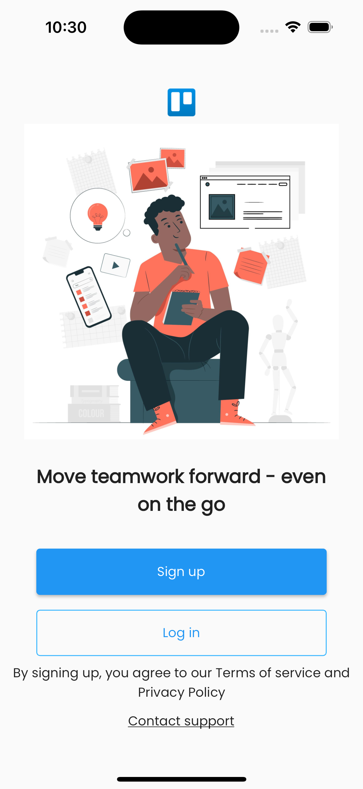

# Serverpod + Flutter

## Introduction

Trello App Clone built with [Flutter](https://flutter.dev/) :star2: and [Serverpod](https://serverpod.dev/)

You can find the full tutorial [here](https://www.youtube.com/watch?v=Yn9pQp4Wc7E&list=PLKKf8l1ne4_hHNjCzifoPma3ZAk8hZuia)



## Features

 - Follow on [Instagram](https://www.instagram.com/mobterest/) to see the animation side

## Feedback

- Feel free to send feedback . Feature requests are always welcome. If there's anything you'd like to chat about, please don't hesitate to [reach out](https://www.instagram.com/mobterest/).

## Build process

- Follow the [Flutter Guide](https://flutter.dev/docs/get-started/install) to get started in building with Flutter.
- Clone or download the repo.
- Run ``` flutter pub get ``` to install the necessary packages on your command line that's navigated to the root of the project.
- Invoke the ``` flutter run ``` command.

## Acknowledgements

Thanks to [Flutter](https://flutter.dev/) and [Serverpod](https://serverpod.dev/) for supporting us with amazing products.